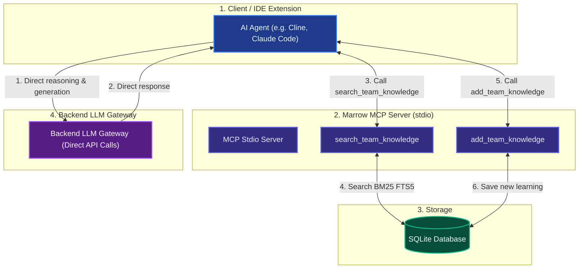
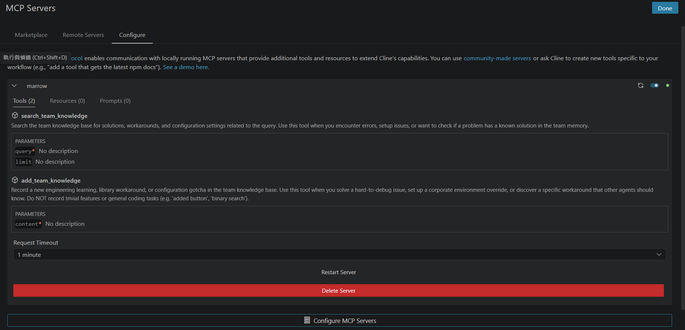
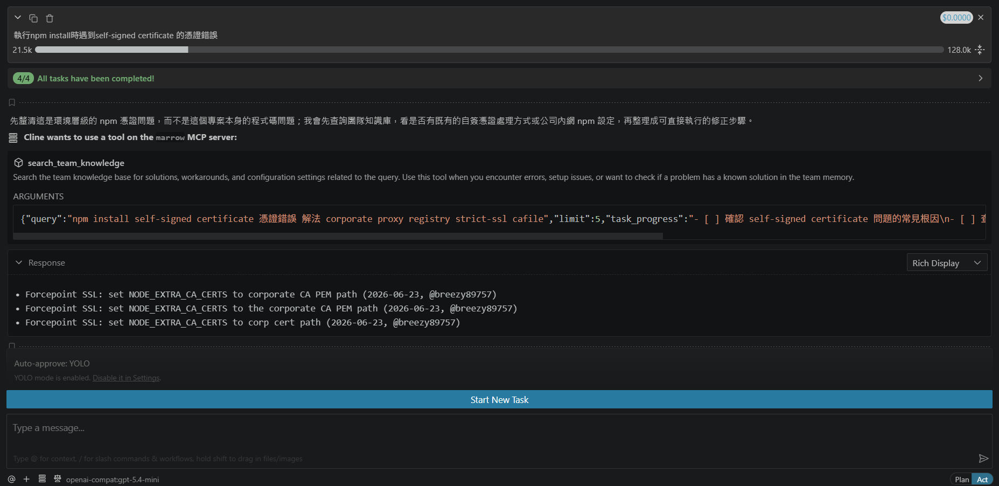
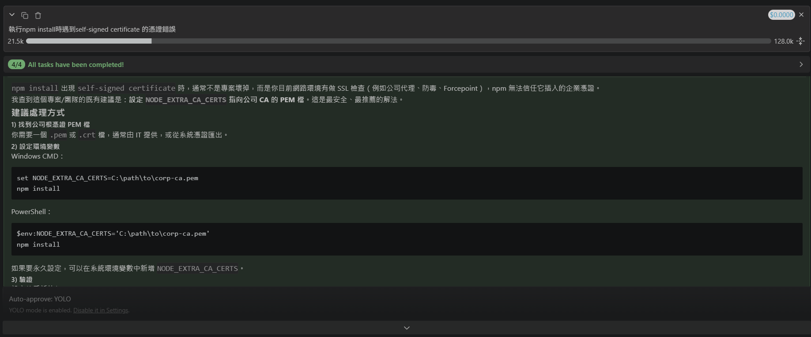

# marrow

> "Your AI agent knows how to code. It doesn't know what your team already learned the hard way."

`marrow` is a lightweight, zero-friction **Model Context Protocol (MCP)** server that connects your AI coding assistant (like Cline, Cursor, or Claude Code) to your local team knowledge base. It provides standard MCP tools to query and record team knowledge (such as corporate cert setups, library bugs, undocumented API details) using full-text search (BM25) on local SQLite databases.

This architecture acts as an **Ouroboros (自循環迴圈)** feedback loop: the agent actively queries its own collective memory using tools, and automatically records its own new learnings back into the database upon successfully resolving complex issues.

> [!NOTE]
> Currently, `marrow` has been tested and verified using **Cline (VS Code)** and **Claude Code**. Support for other MCP-compatible agents is natively inherited.

---

## 🌟 Features

- **Zero-Friction Integration**: Connects as a standard MCP server. No network proxies or silent payload modification.
- **BM25 Search**: Instantly retrieves the top matching team learnings via SQLite FTS5.
- **Ouroboros Memory (Self-Referential)**: The agent actively decides when to query the memory base and records its own learnings when resolving difficult bugs or configurations.
- **Deduplication**: Automatically prevents saving duplicate learnings.
- **Lightweight & Fast**: Local SQLite database storage with zero external dependencies (built on the official lightweight Python `mcp` SDK).

---

## 📐 Architecture

Below is the architecture of `marrow`'s MCP-based implementation, illustrating the self-referential Ouroboros feedback loop:



---

## 📦 Installation

Using `uv` (recommended):
```bash
uv pip install -e .
```

Or standard `pip`:
```bash
pip install -e .
```

---

## 🚀 Quick Start

### 1. Initialize the database
Creates the SQLite database and FTS5 search index (default: `~/.marrow/data.db`):
```bash
marrow init
```

### 2. Start the shared MCP server
Start the server over HTTP (Streamable) so multiple team members or clients can connect:
```bash
# Start on default port 7723
marrow start --host 0.0.0.0 --port 7723
```

### 3. Configure your AI Agent / Client

#### For Cline (VS Code)
Add the following configuration to your `mcp_settings.json` (typically located at `%APPDATA%\Code\User\globalStorage\saoudrizwan.claude-dev\settings\mcp_settings.json`):

```json
{
  "mcpServers": {
    "marrow": {
      "url": "http://localhost:7723/mcp",
      "type": "streamableHttp"
    }
  }
}
```

Once configured, you will see `marrow` and its tools active in the Cline MCP Servers panel:



#### For Claude Code
Add the server using the `claude` CLI:
```bash
claude mcp add marrow http://localhost:7723/mcp
```

### 4. Marrow in Action

When you ask a question related to team knowledge, Cline will call the `search_team_knowledge` tool to retrieve the matching learnings:



Cline will then utilize the retrieved knowledge to provide the correct solution:



---

## 🔧 CLI Reference

- **`marrow init`**: Initialize marrow database.
- **`marrow start`**: Start the marrow MCP server over HTTP (Streamable) transport.
  - `--host`: Host to bind (default: `127.0.0.1`).
  - `--port`: Port to listen on (default: `7723`).
  - `--db-path`: Custom SQLite database file path.
- **`marrow add "<content>"`**: Manually add a knowledge entry.
  - `--author`: Author name (defaults to git user name or system user).
- **`marrow list`**: List all knowledge entries.
- **`marrow search "<query>"`**: Search entries via FTS5 BM25.
- **`marrow delete <id>`**: Delete an entry by ID.

---

## ⚙️ Environment Variables

You can configure `marrow` using these environment variables:

| Variable | Description | Default |
| :--- | :--- | :--- |
| `MARROW_DB_PATH` | Path to the SQLite database file. | `~/.marrow/data.db` |
| `MARROW_AUTHOR` | Default author name for added entries. | *(Git config user name)* |

---

## 📄 License

MIT
